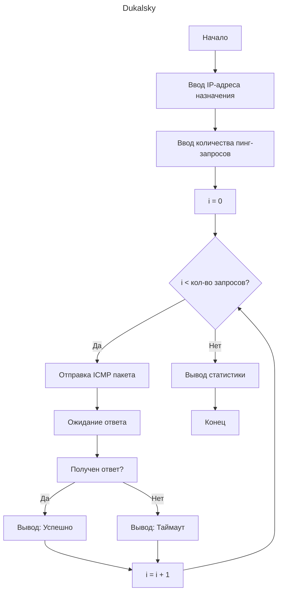
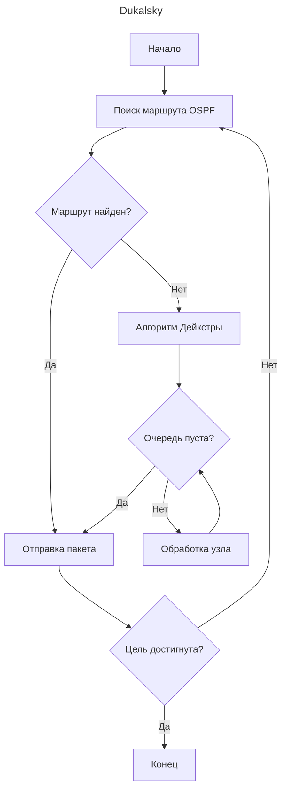
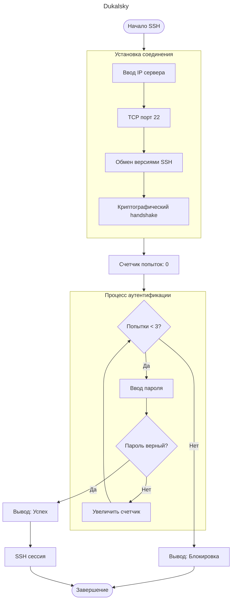
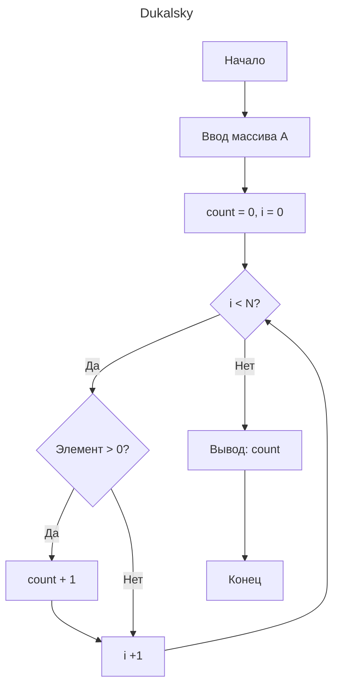

## Практическая часть

### Задание № 1

```mermaid
---
title: Dukalsky
---
graph TD
    A[Начало] --> B[Ввод IP-адреса назначения]
    B --> C[Ввод количества пинг-запросов]
    C --> D[i = 0]
    D --> E{i < кол-во запросов?}
    E --> |Нет| F[Вывод статистики]
    E --> |Да| G[Отправка ICMP пакета]
    G --> H[Ожидание ответа]
    H --> I[Получен ответ?]
    I --> |Да| J[Вывод: Успешно]
    I --> |Нет| K[Вывод: Таймаут]
    J --> L[i = i + 1]
    K --> L
    L --> E
    F --> M[Конец]
```

```mermaid
---
title: Dukalsky
---
graph TD
    A[Начало] --> B[Поиск маршрута OSPF]
    B --> C{Маршрут найден?}
    C -->|Нет| D[Алгоритм Дейкстры]
    C -->|Да| F[Отправка пакета]
    D --> E{Очередь пуста?}
    E -->|Нет| G[Обработка узла]
    G --> E
    E -->|Да| F
    F --> H{Цель достигнута?}
    H -->|Нет| B
    H -->|Да| I[Конец]
```

```mermaid
---
title: Dukalsky
---
flowchart TB
    Start([Начало SSH]) --> Connection
    subgraph Connection[Установка соединения]
        direction TB
        A[Ввод IP сервера] --> B[TCP порт 22]
        B --> C[Обмен версиями SSH]
        C --> D[Криптографический handshake]
    end
    Connection --> E[Счетчик попыток: 0]
    E --> Auth
    subgraph Auth[Процесс аутентификации]
        direction TB
        F{Попытки < 3?} -->|Да| G[Ввод пароля]
        G --> H{Пароль верный?}
        H -->|Нет| I[Увеличить счетчик]
        I --> F
    end
    F -->|Нет| J[Вывод: Блокировка]
    J --> End([Завершение])
    H -->|Да| K[Вывод: Успех]
    K --> Session[SSH сессия]
    Session --> End
```

```mermaid
---
title: Dukalsky
---
flowchart TB
    Start[Начало] --> A[Ввод массива A]
    A --> B[count = 0, i = 0]
    B --> C{i < N?}
    C -->|Да| D{Элемент > 0?}
    D -->|Да| E[count + 1]
    E --> F[i +1]
    D -->|Нет| F
    F --> C
    C -->|Нет| G[Вывод: count]
    G --> End[Конец]
```

